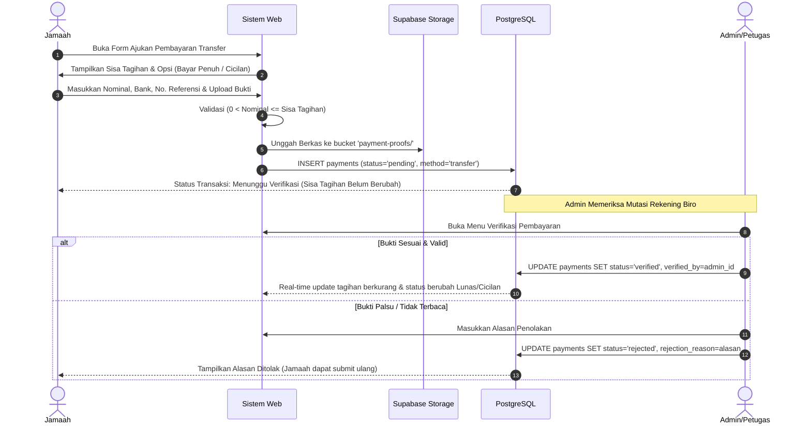
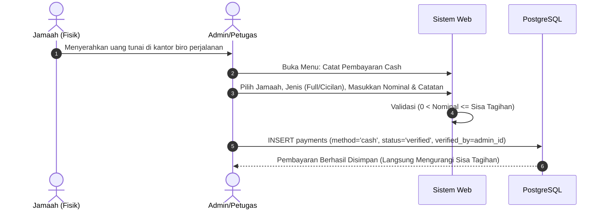

# Spesifikasi Aturan Bisnis & Logika Validasi

Dokumen ini mendefinisikan seluruh aturan bisnis (*business rules*), formula perhitungan finansial, alur verifikasi berkas, dan mesin transisi status jamaah untuk menjamin keakuratan sistem tanpa ambiguitas logika.

---

## 1. Modul Pembayaran (Payment Domain Logic)

Sistem pembayaran haji dan umroh membedakan 3 dimensi data yang berdiri sendiri:

```text
┌─────────────────────────┐     ┌─────────────────────────┐     ┌─────────────────────────┐
│     JENIS PEMBAYARAN    │     │    METODE PEMBAYARAN    │     │    STATUS VERIFIKASI    │
├─────────────────────────┤     ├─────────────────────────┤     ├─────────────────────────┤
│ • full (Bayar Penuh)    │  +  │ • transfer (Transfer)   │  +  │ • pending (Menunggu)    │
│ • installment (Cicilan) │     │ • cash (Tunai)          │     │ • verified (Sah)        │
│                         │     │                         │     │ • rejected (Ditolak)    │
└─────────────────────────┘     └─────────────────────────┘     └─────────────────────────┘
```

---

### 1.1 Delapan Aturan Utama Pembayaran (The 8 Payment Rules)

#### **Rule 1: Transfer Wajib Verifikasi**
Setiap transaksi dengan metode `transfer` yang diinput oleh jamaah **selalu berstatus awal `pending` (Menunggu Verifikasi)**. Dana belum diakui secara legal oleh biro sebelum staf memeriksa mutasi rekening biro travel.

#### **Rule 2: Cash Otomatis Terverifikasi**
Pembayaran dengan metode `cash` **hanya bisa diinput oleh Admin/Petugas** biro perjalanan. Karena petugas menerima uang fisik secara langsung saat pencatatan, sistem secara otomatis memberikan status `verified` tanpa memerlukan verifikasi susulan.

#### **Rule 3: Hanya Status `verified` yang Sah Masuk Perhitungan**
Akumulasi dana pembayaran yang sah dihitung secara ketat hanya dari record dengan status `verified`:
$$\text{Total Terbayar Sah} = \sum_{\text{status} = \text{'verified'}} \text{amount}$$

#### **Rule 4: Status `pending` Tidak Mengurangi Sisa Tagihan**
Pembayaran transfer yang masih berstatus `pending` **tidak boleh mengurangi sisa tagihan**. Nominal transaksi pending ditampilkan secara terpisah di dashboard sebagai *Dana Dalam Proses Verifikasi* agar jamaah dan admin mengetahui ada pengajuan aktif.

#### **Rule 5: Status `rejected` Tidak Mengurangi Sisa Tagihan**
Jika admin menolak bukti transfer karena tidak valid atau nominal tidak sesuai, status menjadi `rejected`. Transaksi ini tetap tersimpan permanen sebagai rekaman audit (*audit trail*), tetapi sama sekali tidak mengurangi sisa tagihan. Jamaah diwajibkan mengajukan pembayaran ulang.

#### **Rule 6: Cicilan Fleksibel (Tanpa Nominal Tetap)**
Besaran cicilan jamaah tidak memiliki batas minimal kaku, melainkan mengikuti kesepakatan dan kemampuan jamaah dengan batasan:
$$0 < \text{Nominal Cicilan} \le \text{Sisa Tagihan Saat Ini}$$

#### **Rule 7: Nominal Tidak Boleh Melebihi Sisa Tagihan**
Sistem wajib menolak (*throw error*) jika pengguna memasukkan nominal pembayaran lebih besar dari sisa tagihan yang harus dilunasi:
$$\text{Nominal Input} \le \text{Sisa Tagihan}$$

#### **Rule 8: Bayar Penuh Mengunci Otomatis Sisa Tagihan**
Jika jamaah atau admin memilih jenis pembayaran `full` (Bayar Penuh):
- Input field nominal **otomatis terisi tepat sebesar Sisa Tagihan**.
- Input field nominal berstatus *read-only* (terkunci), sehingga pengguna tidak dapat mengedit angka tersebut secara manual.

---

### 1.2 Rumus Matematika Perhitungan & Status Pelunasan

1. **Sisa Tagihan**:
   $$\text{Sisa Tagihan} = \max(0, \text{Harga Paket} - \text{Total Terbayar Sah})$$

2. **Penentuan Status Pelunasan Jamaah**:
   - Jika $\text{Total Terbayar Sah} = 0 \longrightarrow \mathbf{\text{Belum Bayar}}$
   - Jika $0 < \text{Total Terbayar Sah} < \text{Harga Paket} \longrightarrow \mathbf{\text{Cicilan}}$
   - Jika $\text{Total Terbayar Sah} \ge \text{Harga Paket} \longrightarrow \mathbf{\text{Lunas}}$

---

### 1.3 Alur Kerja Pembayaran (Workflows)

#### A. Alur Pembayaran Transfer (Diajukan oleh Jamaah)


#### B. Alur Pembayaran Cash (Dicatat oleh Admin)


---

## 2. Modul Dokumen (Document Management Logic)

### 2.1 Jenis Dokumen & Status
Aplikasi mengelola 6 tipe dokumen resmi persyaratan ibadah:
1. `ktp`: Kartu Tanda Penduduk
2. `kk`: Kartu Keluarga
3. `passport`: Paspor Internasional (Masa berlaku min. 7 bulan)
4. `foto`: Pas Foto Formal Khusus Haji/Umrah (Background putih)
5. `buku-nikah`: Buku Nikah (Wajib bagi pasangan suami-istri)
6. `kesehatan`: Surat Keterangan Sehat / Buku Kuning Vaksin Meningitis

Setiap berkas memiliki salah satu dari 4 status verifikasi:
- `Belum Ada`: Jamaah belum mengunggah berkas.
- `Menunggu Verifikasi`: Berkas telah diunggah dan siap diperiksa admin.
- `Lengkap`: Berkas telah diverifikasi sah oleh admin biro travel.
- `Ditolak`: Berkas buram/salah/kedaluwarsa (admin wajib menyertakan catatan kekurangan).

### 2.2 Formula Kelengkapan Dokumen

$$\text{Persentase Kelengkapan} = \left( \frac{\text{Jumlah Dokumen dengan status 'Lengkap'}}{\text{Jumlah Dokumen Wajib}} \right) \times 100\%$$

*Catatan: Pada tahap MVP, jumlah dokumen standar dihitung basis 6 dokumen.*

#### Kategori Persentase:
| Rentang Persentase | Label Status | Warna Indikator |
| :---: | :---: | :---: |
| **$100\%$** | Lengkap | Hijau (*Emerald*) |
| **$70\% - 99\%$** | Hampir Lengkap | Biru (*Sky Blue*) |
| **$1\% - 69\%$** | Belum Lengkap | Kuning / Oranye (*Amber*) |
| **$0\%$** | Belum Ada | Abu-abu (*Slate*) |

---

## 3. Siklus Hidup Status Jamaah (Jamaah Lifecycle State Machine)

Setiap jamaah bergerak melewati tahapan status berikut:

```text
[1. Pendaftaran] ──► [2. Dokumen Diproses] ──► [3. Belum Lunas]
                                                       │
                                                       ▼
[6. Selesai]     ◄── [5. Sudah Berangkat]  ◄── [4. Siap Berangkat]
```

### Kriteria Transisi Status:
1. **Pendaftaran**: Data awal jamaah dibuat oleh admin; belum ada dokumen yang diverifikasi.
2. **Dokumen Diproses**: Berkas dokumen mulai diunggah dan sedang dalam proses verifikasi petugas biro.
3. **Belum Lunas**: Berkas dokumen sudah diverifikasi lengkap atau hampir lengkap, tetapi status pembayaran masih `Belum Bayar` atau `Cicilan`.
4. **Siap Berangkat**: Syarat mutlak: **Dokumen 100% Lengkap** DAN **Status Pembayaran Lunas** (`sisa_tagihan = 0`). Jamaah siap mengikuti manasik dan keberangkatan.
5. **Sudah Berangkat**: Jamaah telah take-off dan sedang menjalankan rangkaian ibadah di tanah suci.
6. **Selesai**: Rombongan jamaah telah kembali ke tanah air dengan selamat dan seluruh urusan administrasi ditutup.
